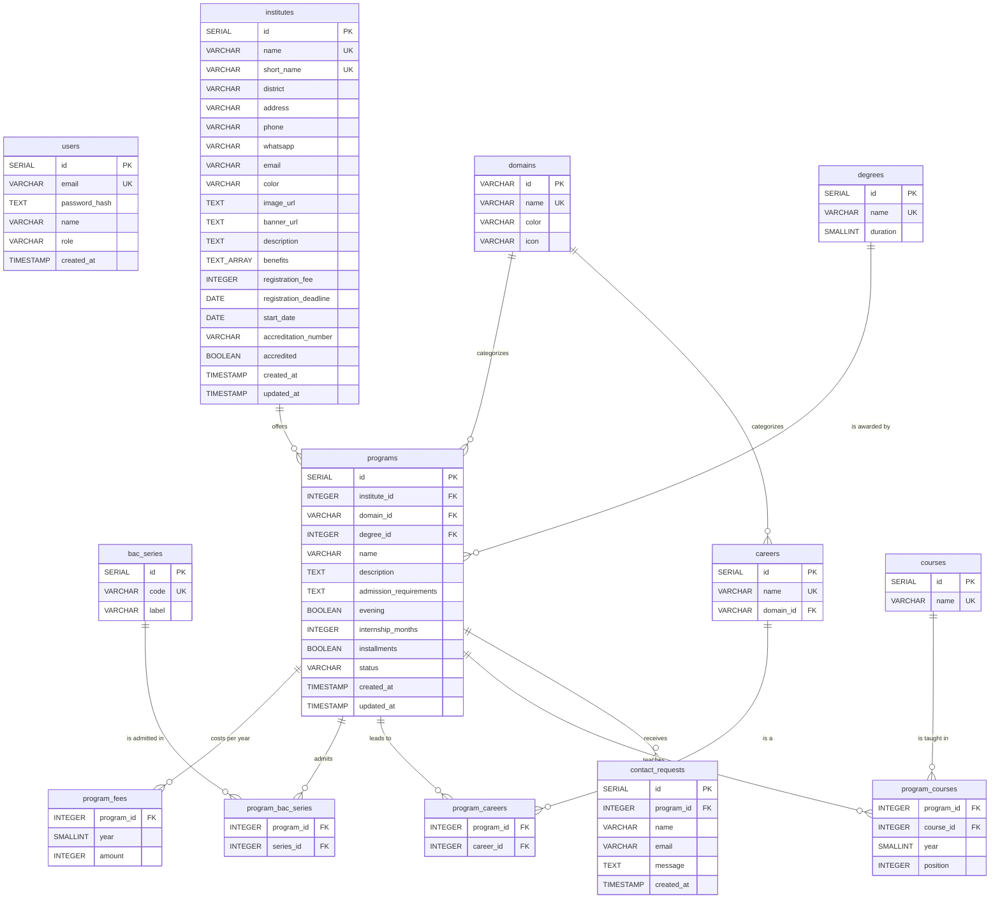

# Orienta Brazzaville - Database Schema

The schema follows the back-office: every list the Squad manages there is a table
here. The executable version is `backend/scripts/migrate.sql`; `docs/schema.sql`
is its plain-DDL reference copy.

## Entity-Relationship Diagram (Mermaid)

## Table Descriptions

### `users`
Squad members who can access the back-office (EX-15, EX-16). They sign in with their e-mail address and password.

| Column | Type | Description |
|---|---|---|
| id | SERIAL PK | Unique identifier |
| email | VARCHAR(150) UNIQUE NOT NULL | Login identifier |
| password_hash | TEXT | Bcrypt hash |
| name | VARCHAR(100) | Display name |
| role | VARCHAR(20) | Role (default: `superadmin`) |
| created_at | TIMESTAMP | Account creation date |

### `domains`
Domains of insertion (Gestion, Informatique, Santé…). They classify programs and
careers, and form the category bar of the public site.

| Column | Type | Description |
|---|---|---|
| id | VARCHAR(20) PK | Stable slug (ex: `gestion`, `info`, `sante`); renaming a domain never changes it |
| name | VARCHAR(100) UNIQUE | Display name |
| color | VARCHAR(7) | Hex color for the program covers |
| icon | VARCHAR(40) | Font Awesome icon name without the `fa-` prefix (ex: `stethoscope`), chosen in the back-office; default `shapes` |

A domain still used by a program or a career cannot be deleted.

### `degrees`
Degrees awarded (BTS, Licence, Licence pro, Master…).

| Column | Type | Description |
|---|---|---|
| id | SERIAL PK | Unique identifier |
| name | VARCHAR(50) UNIQUE | Degree name |
| duration | SMALLINT | Length of studies in years (1 to 5) |

The length of studies belongs to the degree: every program awarding it lasts
`duration` years. A degree still used by a program cannot be deleted.

### `bac_series`
Series of the baccalauréat (A, B, C, D…), used as admission criteria.

| Column | Type | Description |
|---|---|---|
| id | SERIAL PK | Unique identifier |
| code | VARCHAR(10) UNIQUE | Series code (ex: `A`, `C`) |
| label | VARCHAR(100) | Label (ex: `Lettres`) |

### `institutes`
Private higher education institutes in Brazzaville.

| Column | Type | Description |
|---|---|---|
| id | SERIAL PK | Unique identifier |
| name | VARCHAR(200) UNIQUE | Full name |
| short_name | VARCHAR(20) UNIQUE | Acronym (ex: ISGF, ESIM) |
| district | VARCHAR(50) | One of the 9 Brazzaville districts, written with accents (`Makélékélé`, `Talangaï`…) - CHECK constraint |
| address | VARCHAR(300) | Physical address |
| phone | VARCHAR(20) | Phone number |
| whatsapp | VARCHAR(20) | WhatsApp number (international, no +) |
| email | VARCHAR(150) | Contact email |
| color | VARCHAR(7) | Cover color (hex) |
| image_url | TEXT | Image shown on the institute cards (null → color cover) |
| banner_url | TEXT | Wide image shown as the banner of the institute page (null → `image_url`, then color cover) |
| description | TEXT | Presentation text |
| benefits | TEXT[] | Optional advantages (library, grants…), one per element |
| registration_fee | INTEGER | Registration fee in FCFA |
| registration_deadline | DATE | Enrollment deadline |
| start_date | DATE | School year start (not before the deadline) |
| accreditation_number | VARCHAR(100) | Official accreditation number; null = not accredited |
| accredited | BOOLEAN (generated) | True when `accreditation_number` is set - drives the blue badge (EX-05 / EX-14) |
| created_at | TIMESTAMP | Creation date |
| updated_at | TIMESTAMP | Last update date |

### `programs`
Training programs offered by institutes. A program belongs to one institute; two
institutes may offer a program with the same name.

| Column | Type | Description |
|---|---|---|
| id | SERIAL PK | Unique identifier |
| institute_id | INTEGER FK → institutes | Owning institute (programs are deleted with it) |
| domain_id | VARCHAR(20) FK → domains | Domain of insertion |
| degree_id | INTEGER FK → degrees | Degree awarded; gives the length of studies |
| name | VARCHAR(200) | Program name, unique within the institute |
| description | TEXT | Short presentation shown on the public page |
| admission_requirements | TEXT | Admission conditions other than the bac series |
| evening | BOOLEAN | Evening classes available |
| internship_months | INTEGER | Internship duration, 0 to 12 (0 = none) |
| installments | BOOLEAN | Payment in installments |
| status | VARCHAR(10) | `published` (visible on the public site) or `draft` |
| created_at | TIMESTAMP | Creation date |
| updated_at | TIMESTAMP | Last update date |

### `program_fees`
Yearly tuition per year of study ("tarifs par niveau").

| Column | Type | Description |
|---|---|---|
| program_id | INTEGER FK → programs | Program |
| year | SMALLINT | Year of study, from 1 |
| amount | INTEGER | Tuition for that year, in FCFA |

The API keeps `year` within the degree duration.

### `program_bac_series`
Bac series admitted by a program. No row for a program means the series is not an
admission criterion.

| Column | Type | Description |
|---|---|---|
| program_id | INTEGER FK → programs | Program |
| series_id | INTEGER FK → bac_series | Admitted series |

A series still attached to a program cannot be deleted.

### `careers`
Career outcomes ("débouchés").

| Column | Type | Description |
|---|---|---|
| id | SERIAL PK | Unique identifier |
| name | VARCHAR(100) UNIQUE | Career name |
| domain_id | VARCHAR(20) FK → domains | Domain of insertion |

### `program_careers`
Many-to-many relationship between programs and careers. A career still attached
to a program cannot be deleted.

| Column | Type | Description |
|---|---|---|
| program_id | INTEGER FK → programs | Program |
| career_id | INTEGER FK → careers | Career |

### `courses`
Shared catalogue of courses: one course (Français, Mathématiques…) can be
attached to several programs.

| Column | Type | Description |
|---|---|---|
| id | SERIAL PK | Unique identifier |
| name | VARCHAR(200) UNIQUE | Course name |

### `program_courses`
Curriculum of a program, year by year. A course is attached once to a program.
Deleting a course removes it from every program.

| Column | Type | Description |
|---|---|---|
| program_id | INTEGER FK → programs | Program |
| course_id | INTEGER FK → courses | Course |
| year | SMALLINT | Year of study, from 1 (kept within the degree duration by the API) |
| position | INTEGER | Display order within the program |

### `contact_requests`
Questions sent from a public program page and relayed by e-mail to the institute
(EX-06). The back-office has no inbox for them.

| Column | Type | Description |
|---|---|---|
| id | SERIAL PK | Unique identifier |
| program_id | INTEGER FK → programs | Concerned program |
| name | VARCHAR(100) | Student name |
| email | VARCHAR(150) | Student email |
| message | TEXT | Question / message |
| created_at | TIMESTAMP | Submission date |

## Indexes

| Table | Column | Purpose |
|---|---|---|
| institutes | district | Filter by district |
| programs | institute_id | Filter by institute |
| programs | domain_id | Filter by domain |
| programs | degree_id | Filter by degree |
| programs | status | Public site reads published programs only |
| program_fees | amount | Filter by budget |
| program_bac_series | series_id | Filter by bac series |
| careers | domain_id | Filter by domain |
| program_careers | career_id | Filter by career |
| program_courses | course_id | Programs of a course |

## Views

### `indicators`
The 5 KPI of the Squad dashboard (EX-07).

| Column | Description |
|---|---|
| nb_institutes | Total number of institutes |
| nb_programs | Total number of programs |
| nb_districts_covered | Number of districts covered (out of 9) |
| nb_degrees | Number of degrees |
| nb_careers | Total number of careers |
