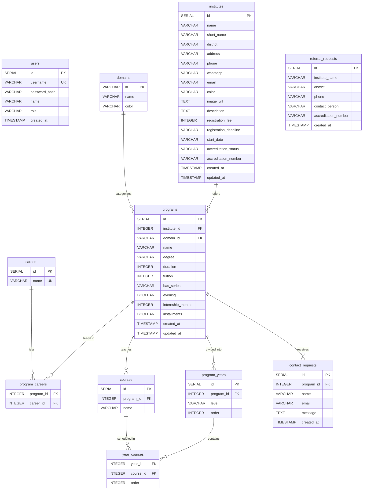

# Kelasi Brazzaville — Database Schema

## Entity-Relationship Diagram (Mermaid)

## Table Descriptions

### `users`
Squad members who can access the back-office.

| Column | Type | Description |
|---|---|---|
| id | SERIAL PK | Unique identifier |
| username | VARCHAR(50) UNIQUE | Login identifier |
| password_hash | VARCHAR | Bcrypt hash |
| name | VARCHAR(100) | Display name |
| role | VARCHAR(20) | Role (default: `squad`) |
| created_at | TIMESTAMP | Account creation date |

### `domains`
The 10 training domains (Gestion, Info, Santé, BTP, etc.).

| Column | Type | Description |
|---|---|---|
| id | VARCHAR(20) PK | Slug (ex: `gestion`, `info`, `sante`) |
| name | VARCHAR(100) | Display name |
| color | VARCHAR(7) | Hex color for the cover |

### `institutes`
Private higher education institutes in Brazzaville.

| Column | Type | Description |
|---|---|---|
| id | SERIAL PK | Unique identifier |
| name | VARCHAR(200) | Full name |
| short_name | VARCHAR(20) | Acronym (ex: ISGF, ESIM) |
| district | VARCHAR(50) | One of the 9 Brazzaville districts |
| address | VARCHAR(300) | Physical address |
| phone | VARCHAR(20) | Phone number |
| whatsapp | VARCHAR(20) | WhatsApp number (international, no +) |
| email | VARCHAR(150) | Contact email |
| color | VARCHAR(7) | Cover color (hex) |
| image_url | TEXT | Institute image (null → color cover) |
| description | TEXT | Presentation text |
| registration_fee | INTEGER | Registration fee in FCFA |
| registration_deadline | VARCHAR(50) | Enrollment deadline |
| start_date | VARCHAR(50) | School year start |
| accreditation_status | VARCHAR(10) | `agre` or `en_cours` |
| accreditation_number | VARCHAR(100) | Official accreditation number (null if en_cours) |
| created_at | TIMESTAMP | Creation date |
| updated_at | TIMESTAMP | Last update date |

### `programs`
Training programs offered by institutes.

| Column | Type | Description |
|---|---|---|
| id | SERIAL PK | Unique identifier |
| institute_id | INTEGER FK → institutes | Owning institute |
| domain_id | VARCHAR(20) FK → domains | Training domain |
| name | VARCHAR(200) | Program name |
| degree | VARCHAR(20) | `BTS`, `Licence`, `Licence pro`, `Master` |
| duration | INTEGER | Duration in years (2 or 3) |
| tuition | INTEGER | Annual tuition in FCFA |
| bac_series | VARCHAR(10) | Accepted bac series (ex: `ABCDG`, null if post-Licence) |
| evening | BOOLEAN | Evening classes available |
| internship_months | INTEGER | Internship duration (0 = none) |
| installments | BOOLEAN | Payment in installments |
| created_at | TIMESTAMP | Creation date |
| updated_at | TIMESTAMP | Last update date |

### `careers`
Career outcomes / job opportunities.

| Column | Type | Description |
|---|---|---|
| id | SERIAL PK | Unique identifier |
| name | VARCHAR(100) UNIQUE | Career name |

### `program_careers`
Many-to-many relationship between programs and careers.

| Column | Type | Description |
|---|---|---|
| program_id | INTEGER FK → programs | Program |
| career_id | INTEGER FK → careers | Career |

### `courses`
Courses / subjects taught in each program.

| Column | Type | Description |
|---|---|---|
| id | SERIAL PK | Unique identifier |
| program_id | INTEGER FK → programs | Parent program |
| name | VARCHAR(200) | Course name |

### `program_years`
Program breakdown by year (L1, L2, L3, M1, M2, etc.).

| Column | Type | Description |
|---|---|---|
| id | SERIAL PK | Unique identifier |
| program_id | INTEGER FK → programs | Parent program |
| level | VARCHAR(20) | Year label (L1, L2, L3, 1re année, M1, M2) |
| order | INTEGER | Display order |

### `year_courses`
Many-to-many relationship between program years and courses (ordered).

| Column | Type | Description |
|---|---|---|
| year_id | INTEGER FK → program_years | Program year |
| course_id | INTEGER FK → courses | Course |
| order | INTEGER | Display order |

### `contact_requests`
Contact form submissions (student → institute).

| Column | Type | Description |
|---|---|---|
| id | SERIAL PK | Unique identifier |
| program_id | INTEGER FK → programs | Concerned program |
| name | VARCHAR(100) | Student name |
| email | VARCHAR(150) | Student email |
| message | TEXT | Question / message |
| created_at | TIMESTAMP | Submission date |

### `referral_requests`
Institute referral requests (public form).

| Column | Type | Description |
|---|---|---|
| id | SERIAL PK | Unique identifier |
| institute_name | VARCHAR(200) | Institute name |
| district | VARCHAR(50) | District |
| phone | VARCHAR(20) | Phone number |
| contact_person | VARCHAR(100) | Responsible person |
| accreditation_number | VARCHAR(100) | Accreditation number (optional) |
| created_at | TIMESTAMP | Submission date |

## Indexes

| Table | Column | Purpose |
|---|---|---|
| institutes | district | Filter by district |
| programs | institute_id | Filter by institute |
| programs | domain_id | Filter by domain |
| programs | degree | Filter by degree |
| programs | duration | Filter by duration |
| programs | tuition | Filter by budget |
| courses | program_id | Filter by program |
| program_years | program_id | Filter by program |

## Views

### `indicators`
KPI for the Squad dashboard.

| Column | Description |
|---|---|
| nb_institutes | Total number of institutes |
| nb_districts_covered | Number of districts covered (out of 9) |
| nb_domains | Number of distinct training domains |
| nb_degrees | Number of distinct degree types |
| nb_careers | Total number of careers |
